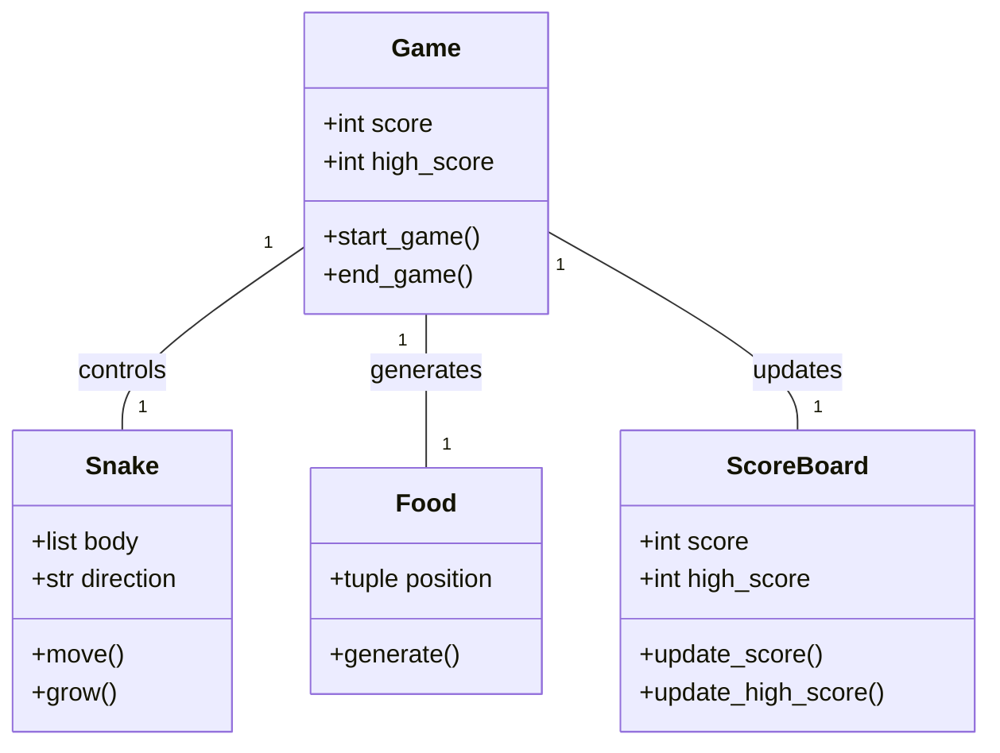
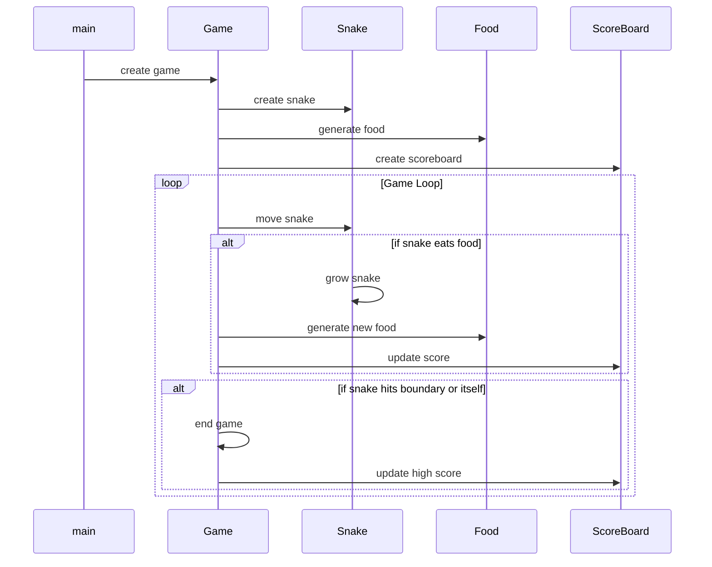

## Implementation approach
To implement this CLI-based snake game, we will use the Pygame library which is an open-source module for Python programming specifically for game development. The game will be developed in a procedural programming style. The main challenges will be to implement the game mechanics such as the snake's movement, eating, growing, and game over conditions. We will also need to implement keyboard controls for the game and design a system for increasing game difficulty as the score increases. We will also create a high score feature to track the player's best performance. Lastly, we need to ensure that the game runs smoothly without any lags or glitches.

## Python package name
```python
"cli_snake_game"
```

## File list
```python
[
    "main.py",
    "game.py",
    "snake.py",
    "food.py",
    "scoreboard.py"
]
```

## Data structures and interface definitions


## Program call flow


## Anything UNCLEAR
The requirement is clear to me.